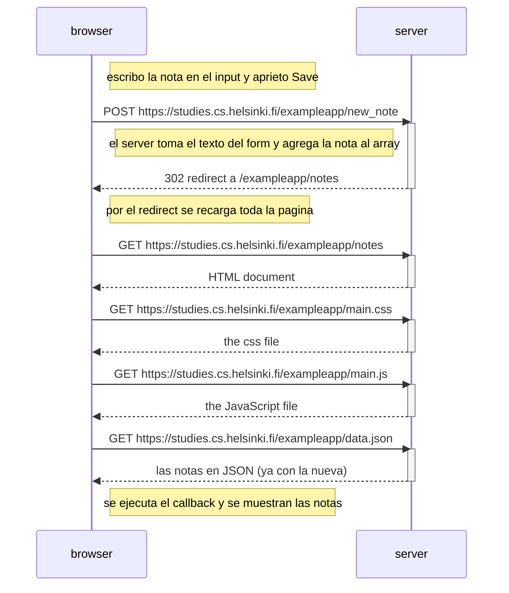

# 0.4 - Nueva nota

Qué pasa cuando creo una nota en https://studies.cs.helsinki.fi/exampleapp/notes y le doy a Save.

Lo que me llamó la atención: para guardar una sola nota el navegador vuelve a pedir todo (html, css, js y json), por el redirect que devuelve el servidor.
