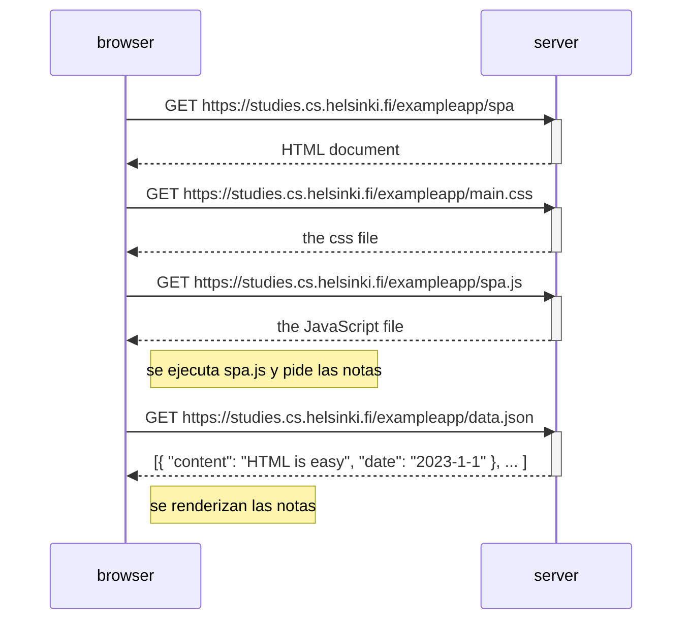

# 0.5 - SPA

Qué pasa cuando entro a la versión SPA en https://studies.cs.helsinki.fi/exampleapp/spa.

Es casi igual a la versión normal, solo que carga `spa.js` en vez de `main.js`. La diferencia se ve recién al guardar una nota (ejercicio 0.6).
