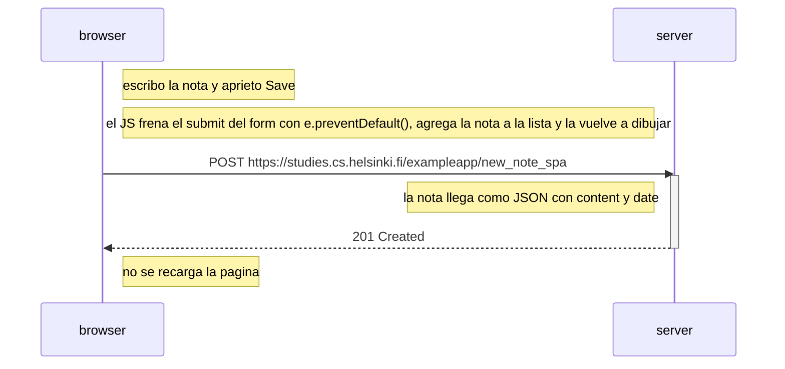

# 0.6 - Nueva nota en la SPA

Qué pasa cuando creo una nota en la versión SPA.

Acá la página no se recarga: se hace un solo POST con la nota en JSON y el server contesta 201. La nota ya se ve antes de que responda porque el JS la agrega directamente.
